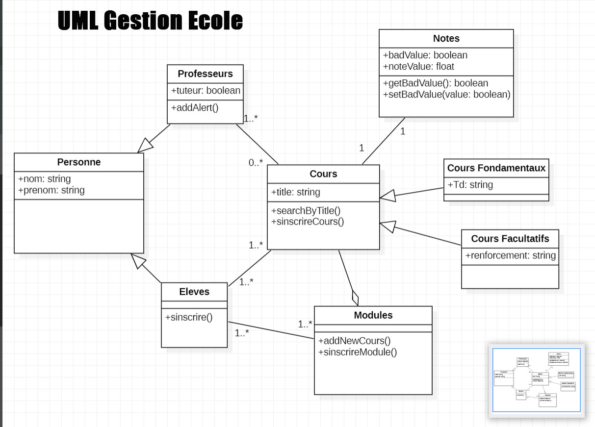
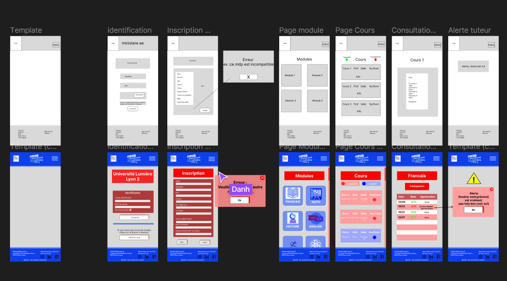

<H1>Projet : LA GESTION D'UNE ECOLE</h1>
 ______________________________________________________________ 

On voudrait réaliser une application complète (Backend + Frontend) de gestion d’une école avec ses deux composantes, étudiants et professeurs. Un étudiant peut s’inscrire à un module auxquels sont associés des cours fondamentaux, d’autres cours facultatifs peuvent y être ajoutés. 
Une note doit être attribuée pour chaque cours. Un professeur enseigne quant à lui plusieurs cours. 

### Réalisation étape par étape
On voudrait réaliser l’application avec les fonctionnalités principales suivantes : 
1️⃣ Inscrire un étudiant à l’école 
2️⃣ Inscrire un étudiant à un module 
3️⃣ Inscrire un étudiant à un cours 
4️⃣ Créer un nouveau cours 
5️⃣ Associer un professeur à un cours 
6. Associer une note à un étudiant pour un cours donné 
7. Alerter un professeur périodiquement pour les étudiants en difficulté jusqu’à ce que le tuteur réagisse. 
8. Rechercher un cours par titre 

### Consignes générales 
1️⃣ Former des équipes de deux personnes  
2️⃣ Faire le diagramme de classe et une ébauche de l’interface homme machine (IHM) 
3️⃣ Passer au codage après validation du diagramme de classe et de l’IHM par le 
formateur 
JE VOUS REMERCIE POUR LA COLLABORATION

🔗 https://www.figma.com/file/3nM7ImJ2Vcc73Z1IoXO2a6/Gestion-%C3%A9cole?node-id=0-1&t=TRx9jRhunEe5Qcux-0

## Ressources et documentations :
Un lien vers votre repository GitHub 
https://github.com/nebulot/gestionecole_05042023-1 

Un lien vers votre repository FIGMA  
https://www.figma.com/file/3nM7ImJ2Vcc73Z1IoXO2a6/Gestion-%C3%A9cole?node-id=0-1&t=TRx9jRhunEe5Qcux-0 

Un lien vers la page web du site

